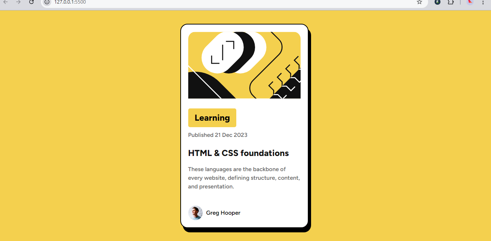

# Frontend Mentor - Blog Preview Card Solution

This is a solution to the [Blog preview card challenge on Frontend Mentor](https://www.frontendmentor.io/challenges/blog-preview-card-ckPaj01IcS). Frontend Mentor challenges help you improve your coding skills by building realistic projects.

## Table of contents

- [Overview](#overview)
  - [The challenge](#the-challenge)
  - [Screenshot](#screenshot)
  - [Links](#links)
- [My process](#my-process)
  - [Built with](#built-with)
  - [What I learned](#what-i-learned)
  - [Continued development](#continued-development)
  - [Useful resources](#useful-resources)
- [Author](#author)

## Overview

### The challenge

Users should be able to:

- See hover and focus states for all interactive elements on the page

### Screenshot

### Links

- Solution URL: https://github.com/noreenfatima775/blog-preview-card.git
- Live Site URL: https://noreenfatima775.github.io/blog-preview-card/
## My process

### Built with

- Semantic HTML5 markup
- CSS custom properties
- Flexbox
- Mobile-first workflow

### What I learned

I learned how to use custom properties in CSS for color management and how to make a card component responsive using Flexbox. Here's a snippet of code that demonstrates how I used custom properties and a mobile-first approach:

### Continued development

In future projects, I want to continue focusing on responsive design techniques, particularly how to use Flexbox and Grid together for more complex layouts. I also plan to explore using more advanced CSS features like animations and transitions to enhance the user experience.

### Useful resources

- [MDN Web Docs] - This is always a great resource for understanding HTML and CSS properties.
- [CSS Tricks] - Helped me understand how to create responsive layouts using Flexbox.

## Acknowledgments

Thanks to Frontend Mentor for providing such an amazing platform to practice coding skills with real-world challenges.
